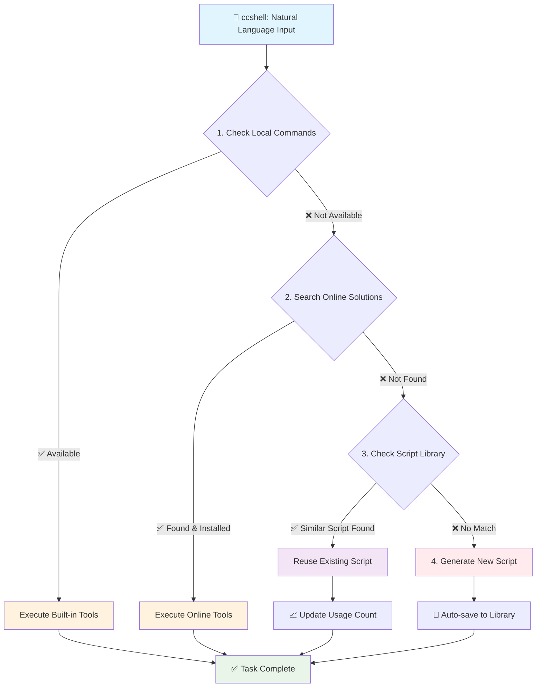

# ccshell

[](https://github.com/terryso/ccshell)
[](https://www.npmjs.com/package/ccshell)
[](https://www.npmjs.com/package/ccshell)
[](https://opensource.org/licenses/MIT)
[](https://nodejs.org/)

🤖 **Natural Language macOS Shell Command Interface**

[**中文文档**](README.zh.md) | **English**

ccshell allows you to describe tasks in natural language and automatically converts them to shell commands for execution. Supporting multiple AI providers (Claude Code CLI and Gemini CLI) with intelligent prompt engineering, it simplifies complex command-line operations into intuitive natural language interactions.

## 🔧 How It Works

ccshell uses an intelligent **four-tier strategy** with built-in script library:



**Strategy Details:**
1. **Prioritize Local Commands** → Use built-in system tools
2. **Search Online Solutions** → Find and install existing tools via package managers  
3. **Reuse Script Library** → Check local library for similar solutions from previous tasks
4. **Generate New Scripts** → Create custom scripts as final fallback option

## ✨ Key Features

- **🗣️ Natural Language Interface**: Describe tasks in natural language without memorizing command syntax
- **🤖 Multiple AI Providers**: Choose between Claude Code CLI (default, detailed output) and Gemini CLI (YOLO mode)
- **📚 Smart Script Library**: Automatically saves and reuses AI-generated scripts for future similar tasks
- **🔧 Intelligent Tool Management**: Automatically detect, install and use the most suitable command-line tools
- **⚡ One-Click Execution**: Seamless automation from task description to result output
- **📊 Real-Time Progress**: Display execution progress, tool usage and task status (Claude)
- **🔓 Flexible Authorization**: Claude uses `--dangerously-skip-permissions`, Gemini uses YOLO mode
- **🍎 macOS Optimized**: Optimized for macOS environment and toolchain

## ⚠️ Important Security Notice

**ccshell uses different permission strategies for different AI providers, both designed for smooth user experience but with potential security risks:**

- **Claude Code CLI** (default): Uses `--dangerously-skip-permissions` parameter
- **Gemini CLI**: Uses `--yolo` mode for automatic command execution

### 🚨 Security Risks
- **Bypass Permission Checks**: Automatically execute all operations without user confirmation
- **File System Access**: May modify, delete or create arbitrary files
- **System Command Execution**: May install software or modify system configurations
- **Network Access**: May download files or access network resources

### 🛡️ Security Recommendations
- **Use in Trusted Environments Only**: Recommended for sandbox environments or personal development machines
- **Avoid Production Environments**: Do not use on production servers or critical data environments
- **Backup Important Data**: Please backup important files and data before use
- **Review Task Content**: Carefully review task descriptions before executing complex tasks

### 📖 Learn More
Check [Claude Code Security Documentation](https://docs.anthropic.com/en/docs/claude-code/security) for detailed information on permission control.

## 📋 Prerequisites

1. **Node.js** (>= 14.0.0)
2. **Claude Code CLI** (required, default): Visit [https://claude.ai/code](https://claude.ai/code) for installation
3. **Gemini CLI** (optional): Install Gemini CLI as alternative AI provider

## 🚀 Quick Start

### Installation

📦 **[Available on npm](https://www.npmjs.com/package/ccshell)**

```bash
# Install from npm (recommended)
npm install -g ccshell

# Or use directly with npx (no installation required)
npx ccshell "your task description"

# Or install from source
git clone https://github.com/terryso/ccshell.git
cd ccshell
npm install -g .
```

### Basic Usage

```bash
# Get Help
ccshell --help
ccshell -h

# Check Version
ccshell --version
ccshell -v

# Configuration and Script Management
ccshell --config                    # Show current configuration
ccshell --set-default gemini        # Set Gemini as default AI provider
ccshell --set-default claude        # Set Claude as default AI provider

# Script Library Management
ccshell --scripts                   # View all saved scripts
ccshell --delete-script <id>        # Delete specific script by ID
ccshell --clean-scripts             # Remove scripts older than 30 days
ccshell --clean-orphaned            # Clean up orphaned script files
ccshell --disable-library "task"    # Disable script library for one command

# Examples (with global installation)
ccshell "rename all files in current directory to match their content"
ccshell "send an iMessage to phone number 13487656789: hello"
ccshell "list all files in the current directory"
ccshell "compress all images in this folder"
ccshell "convert all .mov files to .mp4 format"
ccshell "download the highest quality version of this YouTube video"

# Using specific AI provider
ccshell --provider gemini "compress all images in this folder"
ccshell --provider claude "convert all .mov files to .mp4 format"

# Examples (with npx - no installation required)
npx ccshell "rename all files in current directory to match their content"
npx ccshell "send an iMessage to phone number 13487656789: hello"
npx ccshell "list all files in the current directory"
npx ccshell "compress all images in this folder"
npx ccshell "convert all .mov files to .mp4 format"
npx ccshell "download the highest quality version of this YouTube video"

# Using specific AI provider with npx
npx ccshell --provider gemini "compress all images in this folder"
npx ccshell --set-default gemini

# Real-time Progress Example (Claude Code - Default)
🤖 ccshell: Processing your task...
📋 Task: list all files in the current directory
🤖 AI Provider / AI Provider: claude
🚀 Claude initialization complete, starting task...
🔧 Executing tool: Bash
📝 Operation: List all files with details
[execution results]
✅ Task completed (Duration: 12.4s)
💰 Cost: $0.023047
```

## 🎯 Use Cases

### 📁 File Operations
```bash
ccshell "rename all files in current directory to match their content"
ccshell "batch rename files with timestamp prefix"
ccshell "find all files larger than 100MB"
ccshell "create a backup folder with current date"

# Or with npx
npx ccshell "rename all files in current directory to match their content"
npx ccshell "batch rename files with timestamp prefix"
npx ccshell "find all files larger than 100MB"
```

### 🎬 Media Processing
```bash
# Using default AI provider
ccshell "convert all HEIC photos to JPEG"
ccshell "compress video file size while maintaining reasonable quality"
ccshell "extract audio from video file"

# Using specific AI provider
ccshell --provider gemini "convert all HEIC photos to JPEG"
ccshell --provider claude "compress video file size while maintaining reasonable quality"

# Or with npx
npx ccshell --provider gemini "extract audio from video file"
```

### 🌐 Network Tasks
```bash
ccshell "download all images from a webpage"
ccshell "set up a local HTTP server on port 8080"
ccshell "check website response time"

# Or with npx
npx ccshell "download all images from a webpage"
npx ccshell "set up a local HTTP server on port 8080"
```

### ⚙️ System Management
```bash
ccshell "send an iMessage to phone number 13487656789: hello"
ccshell "clean system cache files"
ccshell "monitor CPU and memory usage"
ccshell "check port 8080 usage"

# Or with npx
npx ccshell "send an iMessage to phone number 13487656789: hello"
npx ccshell "clean system cache files"
npx ccshell "monitor CPU and memory usage"
```

### 📚 Script Library Management
```bash
# View all saved scripts with metadata
ccshell --scripts

# Example output:
# 📚 本地脚本库 / Local Script Library:
# 总计 3 个脚本：
# Total 3 scripts:
# 
# 1. Create backup script
#    ID: bf531412e061
#    Created: 8/14/2025, 5:15:04 PM
#    Updated: 8/14/2025, 5:15:04 PM
#    Usage: 2

# Delete specific script by ID
ccshell --delete-script bf531412e061

# Clean up old scripts (>30 days)
ccshell --clean-scripts

# Remove orphaned script files
ccshell --clean-orphaned

# Disable script library for one command
ccshell --disable-library "create a new backup script"
```

## 📚 Script Library System

The built-in **Script Library** automatically saves and optimizes your workflow:

- 💾 **Auto-saves scripts**: AI-generated scripts are automatically saved for future reuse
- 🔍 **Smart matching**: Uses keyword-based similarity scoring to find relevant existing scripts  
- 🗂️ **Organized storage**: Scripts stored in `~/.ccshell/scripts/` with metadata tracking
- ⚡ **Quick access**: Reuse proven solutions without regenerating from scratch

### Architecture
```
User Input → ccshell (AI Provider Selection) → AI Analysis & Execution → Results
```

### Supported AI Providers
- **Claude Code CLI** (default): Advanced streaming output with detailed progress and cost tracking
- **Gemini CLI** (optional): Alternative AI provider with YOLO mode for quick operations

### Configuration Management
ccshell automatically creates `~/.ccshell.json` to store:
- Default AI provider selection
- Provider-specific settings
- Command arguments and options

## ⚠️ Security Considerations

- ccshell focuses on **safe file processing operations**
- Avoids dangerous system-level operations
- Seeks user confirmation before executing potentially risky operations
- Recommend backing up important data first

## 🐛 Troubleshooting

### Claude Command Not Found
```bash
# Ensure Claude Code CLI is installed
claude --version

# If not installed, visit:
# https://claude.ai/code
```

### Permission Issues
```bash
# Ensure index.js has execution permissions
chmod +x index.js
```

### Task Execution Timeout
- Complex tasks may require more time
- Check network connection (for tool downloads)
- Ensure sufficient disk space

### Proxy Configuration Issues
```bash
# If you use HTTP proxy, ensure environment variables are set correctly
export http_proxy=http://127.0.0.1:7890
export https_proxy=http://127.0.0.1:7890

# Test if Claude Code can access network properly
claude --version

# If still having issues, try temporarily disabling proxy
unset http_proxy https_proxy all_proxy
ccshell "echo test"
```

### Debug Mode
```bash
# Enable detailed debug information to see full JSON stream
DEBUG=1 ccshell "your task description"
ccshell --debug "your task description"

# Debug output shows detailed Claude execution information
🔍 Debug - Command executed: claude -p --output-format stream-json --verbose --dangerously-skip-permissions
🔍 Debug - Proxy settings:
  http_proxy: http://127.0.0.1:7890
  https_proxy: http://127.0.0.1:7890
  all_proxy: socks5://127.0.0.1:7890
🔍 JSON: {...}
```

## 📊 MVP Success Metrics

- ✅ Support for 20+ common task types
- ✅ Task execution success rate >75%
- ✅ Average response time <45 seconds
- ✅ First-time use within 5 minutes

## 🤝 Contributing

Welcome to contribute code, report issues, or suggest improvements!

1. Fork the project
2. Create feature branch (`git checkout -b feature/AmazingFeature`)
3. Commit changes (`git commit -m 'Add some AmazingFeature'`)
4. Push to branch (`git push origin feature/AmazingFeature`)
5. Open a Pull Request

## 📝 License

MIT License - see [LICENSE](LICENSE) file for details

## 🗺️ Roadmap

### Phase 2: Intelligence Enhancement
- Personalized learning and user preference memory
- Context understanding and task template system
- Batch processing optimization

### Phase 3: Ecosystem Building
- Plugin architecture and community contributions
- Cross-platform support (Linux, Windows)
- API interfaces and deep integration

## 📞 Support

- 🐛 [Issues](https://github.com/terryso/ccshell/issues)
- 💬 [Discussions](https://github.com/terryso/ccshell/discussions)

## ⭐ Star History

[](https://www.star-history.com/#terryso/ccshell&Date)

---

**Making Command Line Simple** 🚀