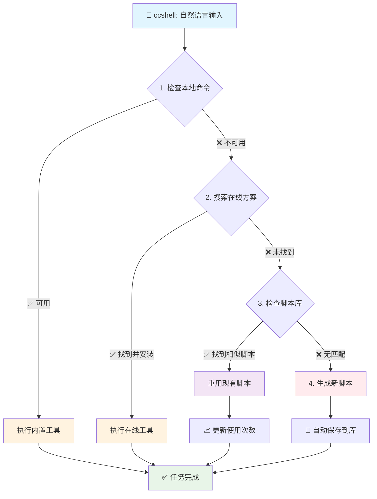

# ccshell

[](https://github.com/terryso/ccshell)
[](https://www.npmjs.com/package/ccshell)
[](https://www.npmjs.com/package/ccshell)
[](https://opensource.org/licenses/MIT)
[](https://nodejs.org/)

🤖 **自然语言 macOS Shell 命令接口**

[**English**](README.md) | **中文文档**

ccshell 让你能够用自然语言描述任务，并自动转换为 shell 命令执行。支持多种 AI 提供商（Claude Code CLI 和 Gemini CLI）和智能提示工程，将复杂的命令行操作简化为直观的自然语言交互。

## 🔧 工作原理

ccshell 使用智能的**四层策略**和内置脚本库：



**策略详情：**
1. **优先本地命令** → 使用内置系统工具
2. **搜索在线方案** → 通过包管理器查找和安装现有工具
3. **重用脚本库** → 检查本地库中来自之前任务的相似解决方案  
4. **生成新脚本** → 创建自定义脚本作为最终后备选项

## ✨ 主要特性

- **🗣️ 自然语言接口**：用自然语言描述任务，无需记忆命令语法
- **🤖 多 AI 提供商**：可选择 Claude Code CLI（默认，详细输出）或 Gemini CLI（YOLO 模式）
- **📚 智能脚本库**：自动保存和重用 AI 生成的脚本，用于未来相似任务
- **🔧 智能工具管理**：自动检测、安装和使用最合适的命令行工具
- **⚡ 一键执行**：从任务描述到结果输出的无缝自动化
- **📊 实时进度显示**：显示执行进度、工具使用情况和任务状态（Claude）
- **🔓 灵活授权方式**：Claude 使用 `--dangerously-skip-permissions`，Gemini 使用 YOLO 模式
- **🍎 macOS 优化**：针对 macOS 环境和工具链进行优化

## ⚠️ 重要安全提示

**ccshell 针对不同 AI 提供商使用不同的权限策略，都旨在提供流畅的用户体验，但可能带来潜在的安全风险：**

- **Claude Code CLI**（默认）：使用 `--dangerously-skip-permissions` 参数
- **Gemini CLI**：使用 `--yolo` 模式自动执行命令

### 🚨 安全风险
- **绕过权限检查**：自动执行所有操作而不需要用户确认
- **文件系统访问**：可能修改、删除或创建任意文件
- **系统命令执行**：可能安装软件或修改系统配置
- **网络访问**：可能下载文件或访问网络资源

### 🛡️ 安全建议
- **仅在可信环境中使用**：建议在沙盒环境或个人开发机器上使用
- **避免生产环境**：不要在生产服务器或关键数据环境中使用
- **备份重要数据**：使用前请备份重要文件和数据
- **审查任务内容**：执行复杂任务前请仔细审查任务描述

### 📖 了解更多
查看 [Claude Code 安全文档](https://docs.anthropic.com/en/docs/claude-code/security) 了解权限控制的详细信息。

## 📋 系统要求

1. **Node.js** (>= 14.0.0)
2. **Claude Code CLI**（必需，默认）：访问 [https://claude.ai/code](https://claude.ai/code) 进行安装
3. **Gemini CLI**（可选）：作为备用 AI 提供商安装 Gemini CLI

## 🚀 快速开始

### 安装

📦 **[npm 包地址](https://www.npmjs.com/package/ccshell)**

```bash
# 从 npm 安装（推荐）
npm install -g ccshell

# 或直接使用 npx（无需安装）
npx ccshell "你的任务描述"

# 或从源码安装
git clone https://github.com/terryso/ccshell.git
cd ccshell
npm install -g .
```

### 基本用法

```bash
# 获取帮助
ccshell --help
ccshell -h

# 查看版本
ccshell --version
ccshell -v

# 配置和脚本管理
ccshell --config                    # 显示当前配置
ccshell --set-default gemini        # 设置 Gemini 为默认 AI 提供商
ccshell --set-default claude        # 设置 Claude 为默认 AI 提供商

# 脚本库管理
ccshell --scripts                   # 查看所有已保存的脚本
ccshell --delete-script <id>        # 根据 ID 删除指定脚本
ccshell --clean-scripts             # 删除超过 30 天的旧脚本
ccshell --clean-orphaned            # 清理孤儿脚本文件
ccshell --disable-library "任务"     # 对一个命令禁用脚本库

# 使用示例（全局安装）
ccshell "将当前目录下面所有文件重新命名, 名字需要和文件内容相符"
ccshell "帮我给手机号13487656789发一条iMessage: hello"
ccshell "列出当前目录下的所有文件"
ccshell "压缩此文件夹中的所有图片"
ccshell "将所有 .mov 文件转换为 .mp4 格式"
ccshell "下载这个 YouTube 视频的最高质量版本"

# 指定 AI 提供商
ccshell --provider gemini "压缩此文件夹中的所有图片"
ccshell --provider claude "将所有 .mov 文件转换为 .mp4 格式"

# 使用示例（npx - 无需安装）
npx ccshell "将当前目录下面所有文件重新命名, 名字需要和文件内容相符"
npx ccshell "帮我给手机号13487656789发一条iMessage: hello"
npx ccshell "列出当前目录下的所有文件"
npx ccshell "压缩此文件夹中的所有图片"
npx ccshell "将所有 .mov 文件转换为 .mp4 格式"
npx ccshell "下载这个 YouTube 视频的最高质量版本"

# 指定 AI 提供商（npx）
npx ccshell --provider gemini "压缩此文件夹中的所有图片"
npx ccshell --set-default gemini

# 实时进度示例（Claude Code - 默认）
🤖 ccshell: 正在处理你的任务...
📋 任务：列出当前目录下的所有文件
🤖 AI提供商 / AI Provider: claude
🚀 Claude 初始化完成，开始执行任务...
🔧 执行工具：Bash
📝 操作：列出所有文件并显示详情
[执行结果]
✅ 任务完成 (耗时: 12.4秒)
💰 费用: $0.023047
```

## 🎯 使用场景

### 📁 文件操作
```bash
# 使用默认 AI 提供商
ccshell "将当前目录下面所有文件重新命名, 名字需要和文件内容相符"
ccshell "批量重命名文件并添加时间戳前缀"
ccshell "查找所有大于 100MB 的文件"
ccshell "创建以当前日期命名的备份文件夹"

# 使用指定 AI 提供商
ccshell --provider gemini "将当前目录下面所有文件重新命名, 名字需要和文件内容相符"
ccshell --provider claude "批量重命名文件并添加时间戳前缀"

# 或使用 npx
npx ccshell --provider gemini "创建以当前日期命名的备份文件夹"
```

### 🎬 媒体处理
```bash
# 使用默认 AI 提供商
ccshell "将所有 HEIC 照片转换为 JPEG"
ccshell "在保持合理质量的情况下压缩视频文件大小"
ccshell "从视频文件中提取音频"

# 使用指定 AI 提供商
ccshell --provider gemini "将所有 HEIC 照片转换为 JPEG"
ccshell --provider claude "在保持合理质量的情况下压缩视频文件大小"

# 或使用 npx
npx ccshell --provider gemini "从视频文件中提取音频"
```

### 🌐 网络任务
```bash
ccshell "下载网页上的所有图片"
ccshell "在 8080 端口设置本地 HTTP 服务器"
ccshell "检查网站响应时间"

# 或使用 npx
npx ccshell "下载网页上的所有图片"
npx ccshell "在 8080 端口设置本地 HTTP 服务器"
```

### ⚙️ 系统管理
```bash
ccshell "帮我给手机号13487656789发一条iMessage: hello"
ccshell "清理系统缓存文件"
ccshell "监控 CPU 和内存使用情况"
ccshell "查看 8080 端口的使用情况"

# 或使用 npx
npx ccshell "帮我给手机号13487656789发一条iMessage: hello"
npx ccshell "清理系统缓存文件"
npx ccshell "监控 CPU 和内存使用情况"
```

### 📚 脚本库管理
```bash
# 查看所有保存的脚本及其元数据
ccshell --scripts

# 示例输出：
# 📚 本地脚本库 / Local Script Library:
# 总计 3 个脚本：
# Total 3 scripts:
# 
# 1. 创建备份脚本
#    ID: bf531412e061
#    创建: 2025/8/14 下午5:15:04
#    更新: 2025/8/14 下午5:15:04
#    使用次数: 2

# 根据 ID 删除指定脚本
ccshell --delete-script bf531412e061

# 清理旧脚本（超过30天）
ccshell --clean-scripts

# 移除孤儿脚本文件
ccshell --clean-orphaned

# 对一个命令禁用脚本库
ccshell --disable-library "创建一个新的备份脚本"
```

## 📚 脚本库系统

内置的**脚本库**自动保存并优化您的工作流程：

- 💾 **自动保存脚本**：AI 生成的脚本自动保存供未来重用
- 🔍 **智能匹配**：使用基于关键词的相似度评分来查找相关的现有脚本
- 🗂️ **有序存储**：脚本存储在 `~/.ccshell/scripts/` 目录中，带有元数据跟踪
- ⚡ **快速访问**：重用已验证的解决方案，无需从头重新生成

### 架构流程
```
用户输入 → ccshell（AI 提供商选择）→ AI 分析执行 → 结果输出
```

### 支持的 AI 提供商
- **Claude Code CLI**（默认）：先进的流式输出，详细的进度显示和成本跟踪
- **Gemini CLI**（可选）：YOLO 模式快速操作的替代 AI 提供商

### 配置管理
ccshell 自动创建 `~/.ccshell.json` 来存储：
- 默认 AI 提供商选择
- 提供商特定设置
- 命令参数和选项

## ⚠️ 安全考虑

- ccshell 专注于**安全的文件处理操作**
- 避免危险的系统级操作
- 在执行潜在风险操作前寻求用户确认
- 建议先备份重要数据

## 🐛 问题排查

### Claude 命令未找到
```bash
# 确保 Claude Code CLI 已安装
claude --version

# 如果未安装，请访问：
# https://claude.ai/code
```

### 权限问题
```bash
# 确保 index.js 有执行权限
chmod +x index.js
```

### 任务执行超时
- 复杂任务可能需要更多时间
- 检查网络连接（用于工具下载）
- 确保有足够的磁盘空间

### 代理配置问题
```bash
# 如果使用 HTTP 代理，确保环境变量设置正确
export http_proxy=http://127.0.0.1:7890
export https_proxy=http://127.0.0.1:7890

# 测试 Claude Code 是否能正常访问网络
claude --version

# 如果仍有问题，尝试临时禁用代理
unset http_proxy https_proxy all_proxy
ccshell "echo test"
```

### 调试模式
```bash
# 启用详细调试信息，查看完整的 JSON 流
DEBUG=1 ccshell "你的任务描述"
ccshell --debug "你的任务描述"

# 调试输出显示详细的 Claude 执行信息
🔍 Debug - 执行的命令：claude -p --output-format stream-json --verbose --dangerously-skip-permissions
🔍 Debug - 代理设置：
  http_proxy: http://127.0.0.1:7890
  https_proxy: http://127.0.0.1:7890
  all_proxy: socks5://127.0.0.1:7890
🔍 JSON: {...}
```

## 📊 MVP 成功指标

- ✅ 支持 20+ 种常见任务类型
- ✅ 任务执行成功率 >75%
- ✅ 平均响应时间 <45 秒
- ✅ 首次使用上手时间 <5 分钟

## 🤝 贡献

欢迎贡献代码、报告问题或建议改进！

1. Fork 项目
2. 创建功能分支 (`git checkout -b feature/AmazingFeature`)
3. 提交更改 (`git commit -m 'Add some AmazingFeature'`)
4. 推送到分支 (`git push origin feature/AmazingFeature`)
5. 打开 Pull Request

## 📝 许可证

MIT 许可证 - 查看 [LICENSE](LICENSE) 文件了解详情

## 🗺️ 发展路线图

### 第二阶段：智能增强
- 个性化学习和用户偏好记忆
- 上下文理解和任务模板系统
- 批处理优化

### 第三阶段：生态建设
- 插件架构和社区贡献
- 跨平台支持（Linux、Windows）
- API 接口和深度集成

## 📞 支持

- 🐛 [问题反馈](https://github.com/terryso/ccshell/issues)
- 💬 [讨论区](https://github.com/terryso/ccshell/discussions)

---

**让命令行变得简单** 🚀